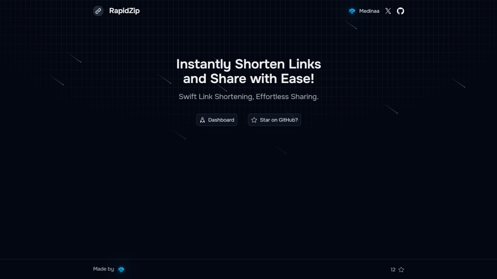

<h1 align="center">
    Rapidzip
</h1>

    <strong>RapidZip</strong> is a user-friendly web application designed to simplify the process of shortening URLs. 
    <strong>
        <a href="https://rapidzip.vercel.app" target="_blank">Application Live 🔮</a>
    </strong>

## 🤯 About Rapidzip

<strong>RapidZip</strong> is a web application designed to simplify the process of shortening URLs, making them easier to share. It provides a seamless experience for generating shortened links and offers analytics to track click statistics.

## 🤗 Contribution

We are open to any contributions!

-   If you like the project, <strong>star this repository </strong> ⭐
-   If you are interested in contributing you can read [Contributing Guide](https://github.com/Medinaadev/rapidzip/blob/main/CONTRIBUTING.md)
       
    

## ✍️ Useful commands

-   `npm install` - install project
-   `npm run dev` - run project locally
-   `npm run test` - run all tests
-   `npm run lint` - check code lints
-   `npm run lint-fix` - try to solve lints errors automatically

## ⚒️ Technologies

-   💙 [Typescript](https://www.typescriptlang.org/)
-   🚀 [Next.js](https://nextjs.org/)
-   ⚛️ [React](https://reactjs.org/)
-   🎨 [TailwindCSS](https://tailwindcss.com)
-   🪢 [Prisma](https://prisma.io/)
-   🔒 [NextAuth.js](https://next-auth.js.org/)
-   🪡 [tRPC](https://trpc.io/)

